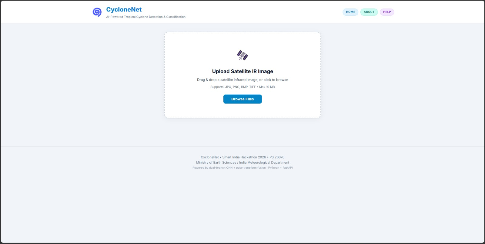
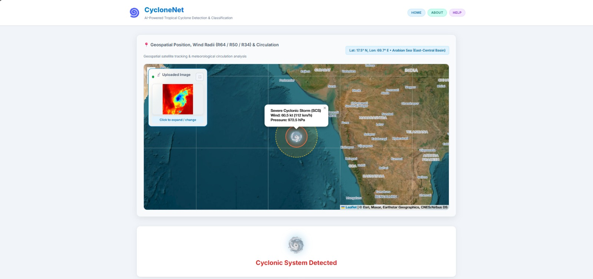
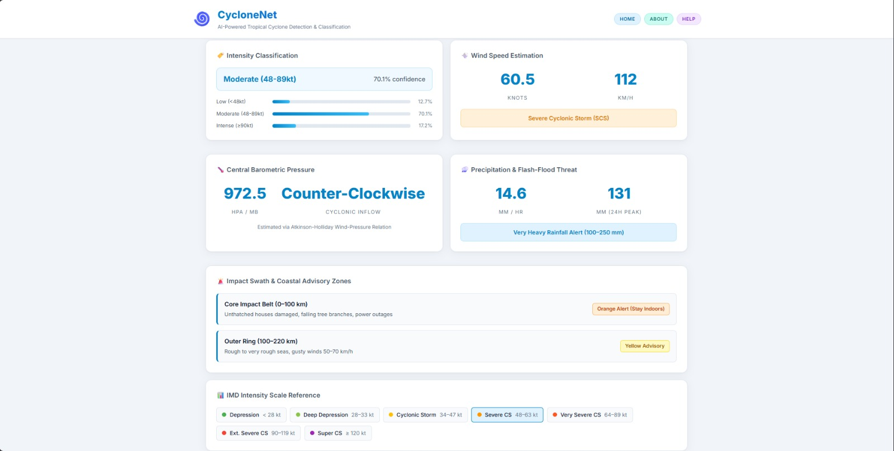

# Project Screenshots

## 01 — Home / Upload Screen

*Clean satellite IR image upload interface with drag & drop support.*

---

## 02 — Cyclone Detected: Geospatial Map View

*Live Leaflet satellite map showing detected cyclone position (Arabian Sea), concentric wind radii (R64/R50/R34), storm popup with wind speed & pressure, and minimized uploaded image card (top-left).*

---

## 03 — Analysis Results Dashboard

*Full results panel: Intensity Classification (Moderate 48–89kt, 70.1% confidence), Wind Speed (60.5 kt / 112 km/h), Central Barometric Pressure (972.5 hPa), Precipitation & Flash-Flood Threat (14.6 mm/hr), Impact Swath & Coastal Advisory Zones, and IMD Intensity Scale Reference.*
